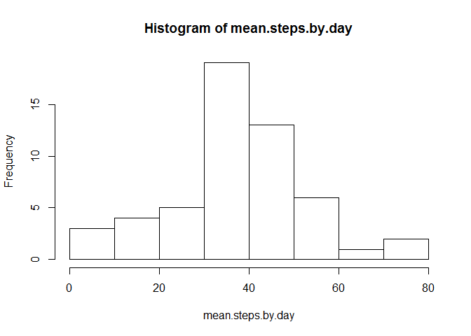
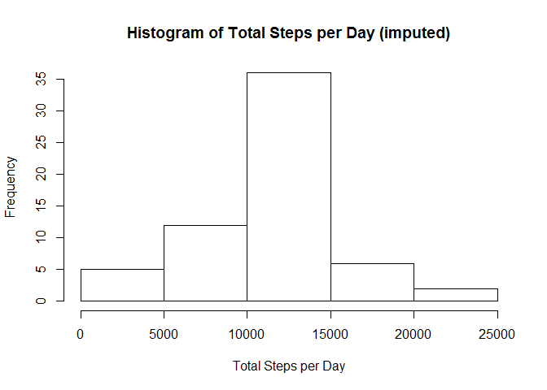
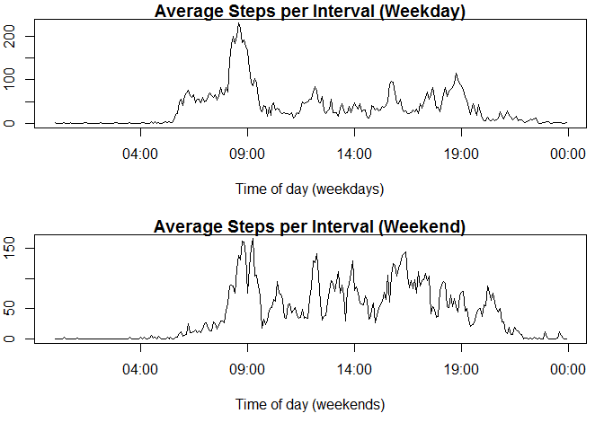

# Reproducible Research: Peer Assessment 1


## Loading and preprocessing the data

```r
dat <- read.csv("activity.csv", colClasses = c("integer", "Date", "integer"))
```
</br>

## What is mean total number of steps taken per day?

```r
total.steps.by.day <- sapply(split(dat, dat$date),
                             function(x) sum(x$steps, na.rm = T))
hist(total.steps.by.day, main = "Histogram of Total Steps per Day", xlab = "Total Steps per Day")
```

 

Mean steps per day

```r
mean(total.steps.by.day, na.rm = TRUE)
```

```
## [1] 9354.23
```
</br>

Median steps per day:

```r
median(total.steps.by.day, na.rm = TRUE)
```

```
## [1] 10395
```
</br>

## What is the average daily activity pattern?

```r
## Find mean steps at each interval, averaged over all days
mean.steps.by.interval <- sapply(split(dat, dat$interval),
                                 function(x) mean(x$steps, na.rm = T))

unique.intervals <- unique(dat$interval)

## Each interval is given leading 0's (120 becomes 0120 and 12 becomes 0012),
## then a colon is insterted between the first two and last two numbers. The
## string is then converted to POSIXlt.
unique.times <- strptime(paste(substr(sprintf("%04d",unique.intervals),1,2),
                               ":",
                               substr(sprintf("%04d",unique.intervals),3,4),
                               sep = ""),
                         "%R") # equivalent to "%H:%M"

## time series plot of steps per 5-minute interval, averaged over all days
plot(unique.times, mean.steps.by.interval, type = "l", main = "Average Steps per Interval",
     xlab = "Time of day (5 min intervals)", ylab = "Mean steps")
```

 
</br>

Interval containing the highest average number of steps over all days:

```r
strftime(unique.times[which(mean.steps.by.interval == max(mean.steps.by.interval))], "%R")
```

```
## [1] "08:35"
```
</br>

## Imputing missing values
Total missing values in the data set:

```r
sum(!complete.cases(dat))
```

```
## [1] 2304
```
</br>

Imput missing values:

```r
## Fill in any missing steps value with the mean steps for that interval over all days
s <- apply(dat, 1,
           function(x){
             if(is.na(x[[1]])){
               x[[1]] <- mean.steps.by.interval[which(unique.intervals == as.integer(x[[3]]))]};
             x[[1]]}) ## return value, regardless of whether or not it changed
dat$steps <- as.numeric(s)
```
</br>

New histogram of total steps per day, with imputed values:

```r
total.steps.by.day.full <- sapply(split(dat, dat$date),
                                 function(x) sum(x$steps, na.rm = T))
hist(total.steps.by.day.full, main = "Histogram of Total Steps per Day (imputed)",
     xlab = "Total Steps per Day")
```

 
</br>

New mean steps per day:

```r
mean(total.steps.by.day.full)
```

```
## [1] 10766.19
```
</br>

New median steps per day:

```r
median(total.steps.by.day.full)
```

```
## [1] 10766.19
```
</br>

## Are there differences in activity patterns between weekdays and weekends?

```r
library(timeDate)
## split data by weekday v. weekend
dat$is.weekday <- isWeekday(dat$date)
weekday.steps <- sapply(split(dat[dat$is.weekday,], dat[dat$is.weekday,]$interval), 
                        function(x) mean(x$steps))
weekdend.steps <- sapply(split(dat[!dat$is.weekday,], dat[!dat$is.weekday,]$interval), 
                        function(x) mean(x$steps))

## set panel and margins for plots
par(mfrow = c(2,1), mar = c(5.1, 2.0, 1.1, 1.0))

## plot weekday and weekend steps separately
plot(unique.times, weekday.steps, type = "l", mar = c(0.0, 2.0, 1.0, 1.0),
     main = "Average Steps per Interval (Weekday)", xlab = "Time of day (weekdays)")

plot(unique.times, weekdend.steps, type = "l", xlab = "Time of day (weekends)",
     main = "Average Steps per Interval (Weekend)")
```

 


