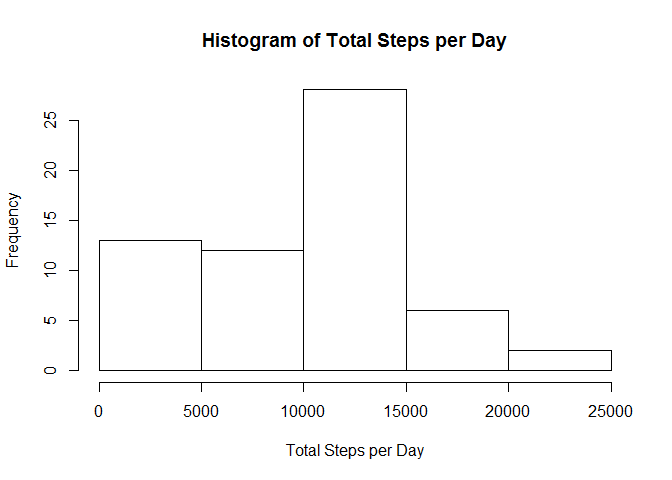
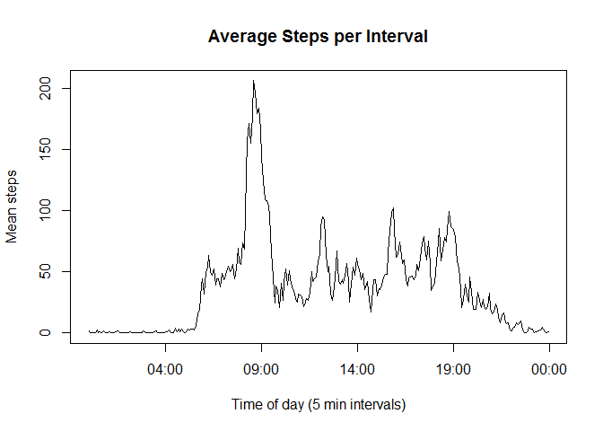

# Reproducible Research: Peer Assessment 1


## Loading and preprocessing the data

```r
dat <- read.csv("activity.csv", colClasses = c("integer", "Date", "integer"))
```


## What is mean total number of steps taken per day?

```r
mean.steps.by.day <- sapply(split(dat, dat$date),
                           function(x) mean(x$steps, na.rm = T))
hist(mean.steps.by.day)
```

 

```r
mean(mean.steps.by.day, na.rm = TRUE)
```

```
## [1] 37.3826
```

```r
median(mean.steps.by.day, na.rm = TRUE)
```

```
## [1] 37.37847
```

## What is the average daily activity pattern?

```r
mean.steps.by.interval <- sapply(split(dat, dat$interval),
                                 function(x) mean(x$steps, na.rm = T))
unique.intervals <- unique(dat$interval)
## Each interval given leading 0's (120 --> 0120), then colon insterted between
## first two and last two numbers... then converted to POSIXlt
unique.times <- strptime(paste(substr(sprintf("%04d",unique.intervals),1,2),
                               ":",
                               substr(sprintf("%04d",unique.intervals),3,4),
                               sep = ""),
                         "%R") # equivalent to "%H:%M"
plot(unique.times, mean.steps.by.interval, type = "l",
     xlab = "Time of day (5 min intervals)", ylab = "Mean steps in 5 min")
```

 

```r
strftime(unique.times[which(mean.steps.by.interval == max(mean.steps.by.interval))], "%R")
```

```
## [1] "08:35"
```

## Inputing missing values

```r
sum(!complete.cases(dat))
```

```
## [1] 2304
```

```r
dat$steps <- as.numeric(apply(dat, 1, function(x) {if(is.na(x[[1]])) {x[[1]] <- mean.steps.by.interval[which(unique.intervals == as.integer(x[[3]]))]}; x[[1]]}))

mean.steps.by.day2 <- sapply(split(dat, dat$date),
                           function(x) mean(x$steps, na.rm = T))
hist(mean.steps.by.day2)
```

 

```r
mean(mean.steps.by.day2)
```

```
## [1] 37.3826
```

```r
median(mean.steps.by.day2)
```

```
## [1] 37.3826
```


## Are there differences in activity patterns between weekdays and weekends?

```r
library(timeDate)
dat$is.weekday <- isWeekday(dat$date)
weekday.steps <- sapply(split(dat[dat$is.weekday,], dat[dat$is.weekday,]$interval), 
                        function(x) mean(x$steps))
weekdend.steps <- sapply(split(dat[!dat$is.weekday,], dat[!dat$is.weekday,]$interval), 
                        function(x) mean(x$steps))
par(mfrow = c(2,1), mar = c(2.0, 2.0, 1.0, 1.0))
plot(unique.times, weekday.steps, type = "l", xlab = "", xaxt = "n", mar = c(0.0, 2.0, 1.0, 1.0))
plot(unique.times, weekdend.steps, type = "l")
```

 


